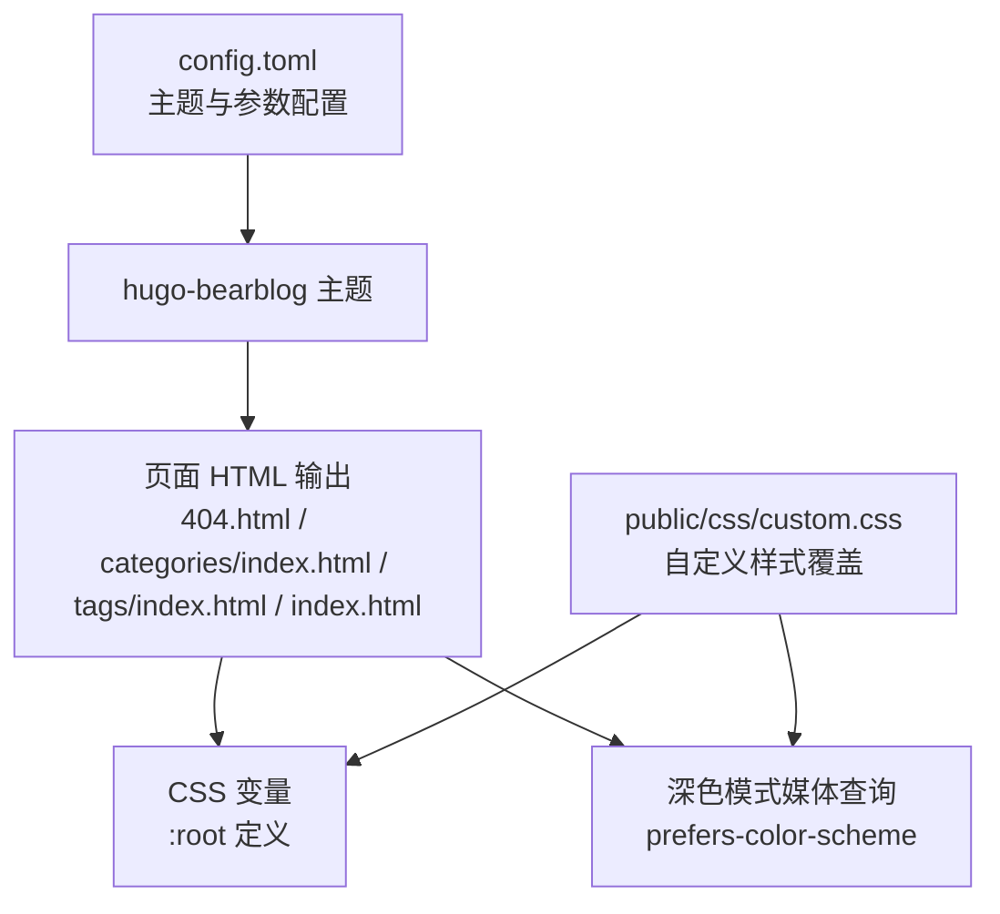
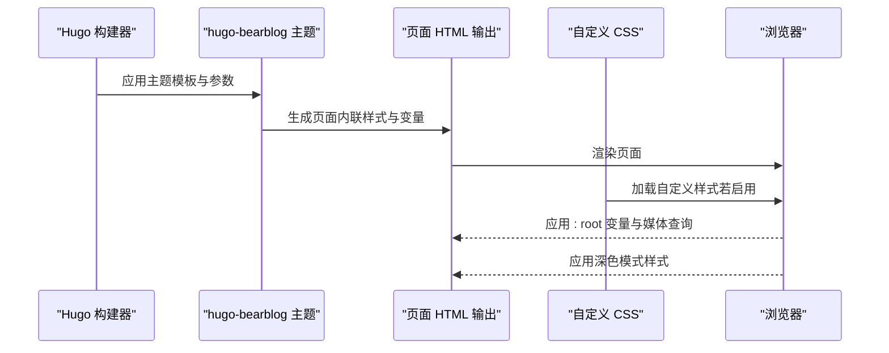
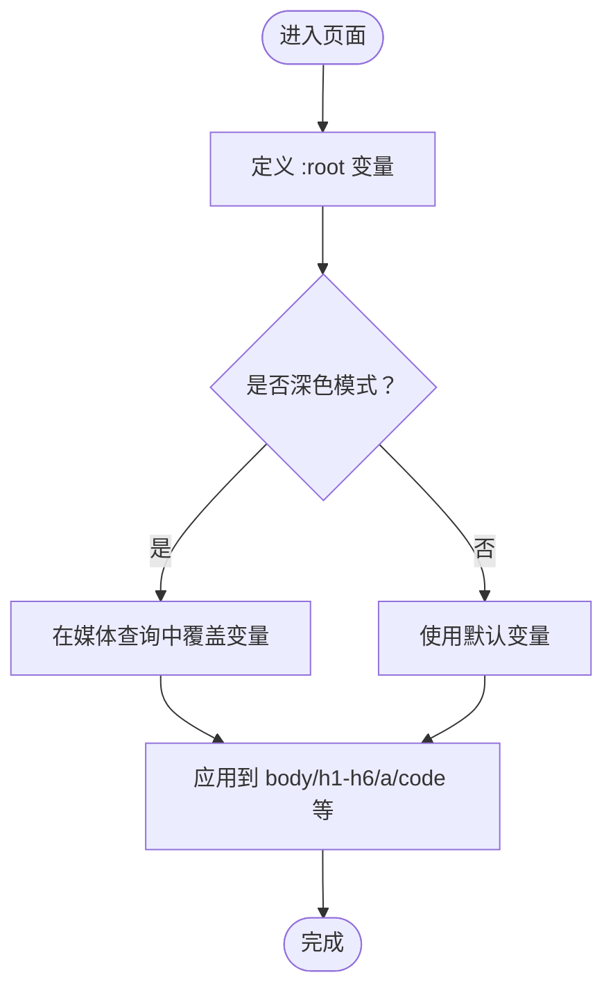
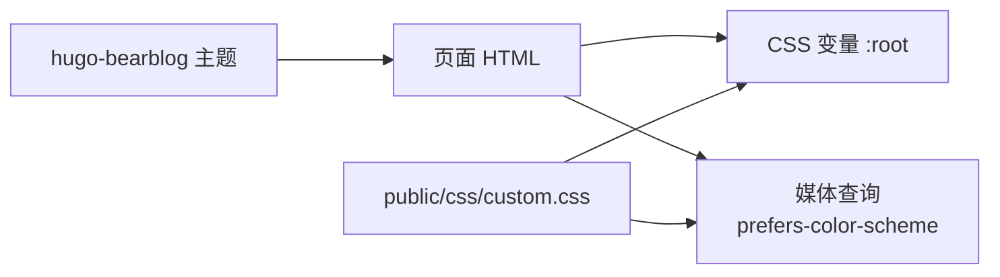

# 主题定制

<cite>
**本文引用的文件**
- [config.toml](file://config.toml)
- [custom.css](file://public/css/custom.css)
- [index.html](file://index.html)
- [404.html](file://public/404.html)
- [categories/index.html](file://public/categories/index.html)
- [tags/index.html](file://public/tags/index.html)
- [_index-copy/index.html](file://public/_index-copy/index.html)
</cite>

## 目录
1. [简介](#简介)
2. [项目结构](#项目结构)
3. [核心组件](#核心组件)
4. [架构总览](#架构总览)
5. [详细组件分析](#详细组件分析)
6. [依赖关系分析](#依赖关系分析)
7. [性能考量](#性能考量)
8. [故障排查指南](#故障排查指南)
9. [结论](#结论)
10. [附录](#附录)

## 简介
本指南面向希望对 BearBlog 主题进行主题与样式定制的用户，围绕以下目标展开：
- 解释主题参数与配置项的作用与启用方式
- 展示如何通过 CSS 变量统一管理布局与配色
- 深入解析深色模式支持与响应式设计原理
- 提供导航菜单、页面布局、按钮样式的定制方法
- 给出媒体查询与浏览器兼容性处理建议
- 以实际文件为依据，给出可对照的修改路径与效果说明

## 项目结构
该仓库采用静态站点生成器输出的纯 HTML/CSS 结构，主题由 hugo-bearblog 提供，样式主要通过内联样式与自定义 CSS 文件实现。关键位置如下：
- 根配置：config.toml（主题声明与可选的自定义 CSS 注册）
- 自定义样式：public/css/custom.css（深色模式与基础样式）
- 页面模板：各页面 HTML（如 404、分类、标签、首页等）
- 示例页面：index.html（Markdown 转换后的页面）

图表来源
- [config.toml:1-8](file://config.toml#L1-L8)
- [custom.css:1-11](file://public/css/custom.css#L1-L11)
- [404.html:32-193](file://public/404.html#L32-L193)
- [categories/index.html:32-194](file://public/categories/index.html#L32-L194)
- [tags/index.html:32-194](file://public/tags/index.html#L32-L194)
- [index.html:45-136](file://index.html#L45-L136)

章节来源
- [config.toml:1-8](file://config.toml#L1-L8)
- [custom.css:1-11](file://public/css/custom.css#L1-L11)
- [404.html:32-193](file://public/404.html#L32-L193)
- [categories/index.html:32-194](file://public/categories/index.html#L32-L194)
- [tags/index.html:32-194](file://public/tags/index.html#L32-L194)
- [index.html:45-136](file://index.html#L45-L136)

## 核心组件
- 主题参数与自定义 CSS 注册
  - 在配置中声明主题名称，并预留了自定义 CSS 的注册入口（当前被注释）。启用后可将自定义样式注入到页面中，优先级高于主题默认样式。
  - 参考路径：[config.toml:1-8](file://config.toml#L1-L8)

- CSS 变量体系
  - 页面通过 :root 定义一组变量，用于控制宽度、字体族、字号、背景、标题、正文、链接、已访问、代码块、引用等颜色与排版。
  - 参考路径：[404.html:33-46](file://public/404.html#L33-L46)，[categories/index.html:34-47](file://public/categories/index.html#L34-L47)，[tags/index.html:34-47](file://public/tags/index.html#L34-L47)

- 深色模式支持
  - 使用媒体查询匹配 prefers-color-scheme: dark，在深色模式下重新定义 :root 变量值，从而统一改变整体配色。
  - 参考路径：[404.html:48-59](file://public/404.html#L48-L59)，[categories/index.html:49-60](file://public/categories/index.html#L49-L60)，[tags/index.html:49-60](file://public/tags/index.html#L49-L60)，[custom.css:1-10](file://public/css/custom.css#L1-L10)

- 导航菜单与布局
  - 页面包含 header 中的标题链接与空的导航区域，可通过在主题或页面中填充导航内容实现菜单定制。
  - 参考路径：[404.html:197-203](file://public/404.html#L197-L203)，[categories/index.html:198-204](file://public/categories/index.html#L198-L204)，[tags/index.html:198-204](file://public/tags/index.html#L198-L204)

- 响应式设计
  - 页面头部包含 viewport 元标签，确保移动端适配；同时通过 CSS 变量与媒体查询实现深色模式下的视觉一致性。
  - 参考路径：[404.html:7](file://public/404.html#L7)，[categories/index.html:7](file://public/categories/index.html#L7)，[tags/index.html:7](file://public/tags/index.html#L7)

章节来源
- [config.toml:1-8](file://config.toml#L1-L8)
- [404.html:33-59](file://public/404.html#L33-L59)
- [categories/index.html:34-60](file://public/categories/index.html#L34-L60)
- [tags/index.html:34-60](file://public/tags/index.html#L34-L60)
- [custom.css:1-10](file://public/css/custom.css#L1-L10)
- [404.html:197-203](file://public/404.html#L197-L203)
- [categories/index.html:198-204](file://public/categories/index.html#L198-L204)
- [tags/index.html:198-204](file://public/tags/index.html#L198-L204)

## 架构总览
BearBlog 主题通过 Hugo 生成静态页面，页面内嵌样式与变量，配合自定义 CSS 实现主题化与深色模式。整体流程如下：

图表来源
- [config.toml:1-8](file://config.toml#L1-L8)
- [404.html:32-193](file://public/404.html#L32-L193)
- [custom.css:1-11](file://public/css/custom.css#L1-L11)

## 详细组件分析

### 组件一：主题参数与自定义 CSS 注册
- 目标
  - 启用主题并注册自定义 CSS，使样式覆盖生效。
- 实施要点
  - 在配置中取消注释自定义 CSS 注册项，指向 public/css/custom.css。
  - 保存后重新构建站点，确认自定义样式加载顺序在主题样式之后。
- 效果说明
  - 自定义 CSS 将在深色模式下覆盖基础变量与链接颜色，实现一致的主题风格。

章节来源
- [config.toml:6-7](file://config.toml#L6-L7)

### 组件二：CSS 变量与深色模式
- 目标
  - 通过 :root 变量集中管理颜色与排版，配合媒体查询实现深色模式。
- 关键结构
  - :root 定义变量（宽度、字体、字号、颜色等）
  - @media (prefers-color-scheme: dark) 重新赋值变量
  - body、h1-h6、a、code、blockquote 等元素使用变量
- 实操建议
  - 修改 :root 中的颜色变量即可批量调整主题色板
  - 在深色模式下仅需更新对应变量值，无需重复写样式

图表来源
- [404.html:33-59](file://public/404.html#L33-L59)
- [categories/index.html:34-60](file://public/categories/index.html#L34-L60)
- [tags/index.html:34-60](file://public/tags/index.html#L34-L60)

章节来源
- [404.html:33-59](file://public/404.html#L33-L59)
- [categories/index.html:34-60](file://public/categories/index.html#L34-L60)
- [tags/index.html:34-60](file://public/tags/index.html#L34-L60)

### 组件三：导航菜单定制
- 目标
  - 在页面 header 中添加或修改导航菜单项，实现多页面跳转与面包屑。
- 实施要点
  - 在 header 中的 nav 区域插入 a 标签，设置 href 指向目标页面
  - 可结合 CSS 变量控制链接颜色与悬停效果
- 效果说明
  - 导航项将继承链接颜色与悬停样式，保持与主题一致

章节来源
- [404.html:197-203](file://public/404.html#L197-L203)
- [categories/index.html:198-204](file://public/categories/index.html#L198-L204)
- [tags/index.html:198-204](file://public/tags/index.html#L198-L204)

### 组件四：页面布局与排版
- 目标
  - 控制页面最大宽度、文字排版、表格与图片等元素的样式。
- 实施要点
  - 通过 :root 的 --width 控制页面最大宽度
  - 使用 --font-main/--font-secondary 控制标题与正文字体族
  - 通过 main、table、img 等选择器统一排版
- 效果说明
  - 页面在不同设备上保持一致的阅读体验

章节来源
- [404.html:61-138](file://public/404.html#L61-L138)
- [categories/index.html:62-139](file://public/categories/index.html#L62-L139)
- [tags/index.html:62-139](file://public/tags/index.html#L62-L139)

### 组件五：按钮样式定制
- 目标
  - 统一按钮的边距、光标与交互状态。
- 实施要点
  - 在按钮选择器中设置 margin 与 cursor
  - 可结合 :hover 状态增强交互反馈
- 效果说明
  - 按钮在不同页面中具有一致的外观与行为

章节来源
- [404.html:104-107](file://public/404.html#L104-L107)
- [categories/index.html:105-108](file://public/categories/index.html#L105-L108)
- [tags/index.html:105-108](file://public/tags/index.html#L105-L108)

### 组件六：媒体查询与响应式设计
- 目标
  - 通过 viewport 与媒体查询实现移动端友好与深色模式适配。
- 实施要点
  - 页面头部设置 viewport，确保缩放与显示正确
  - 使用 prefers-color-scheme: dark 实现深色模式
- 效果说明
  - 移动端与桌面端均能获得良好的阅读与交互体验

章节来源
- [404.html:7](file://public/404.html#L7)
- [404.html:48-59](file://public/404.html#L48-L59)
- [categories/index.html:7](file://public/categories/index.html#L7)
- [tags/index.html:7](file://public/tags/index.html#L7)

### 组件七：自定义 CSS 文件的使用
- 目标
  - 通过 public/css/custom.css 对深色模式与基础样式进行补充与覆盖。
- 实施要点
  - 在配置中启用自定义 CSS 注册
  - 在 custom.css 中使用媒体查询覆盖基础变量或元素样式
- 效果说明
  - 自定义样式优先于主题默认样式，便于长期维护与升级

章节来源
- [config.toml:6-7](file://config.toml#L6-L7)
- [custom.css:1-11](file://public/css/custom.css#L1-L11)

## 依赖关系分析
- 主题与页面
  - hugo-bearblog 主题负责生成页面结构与内联样式
  - 页面通过 :root 变量与媒体查询实现主题化与深色模式
- 自定义 CSS 与页面
  - 自定义 CSS 作为外部资源加载，覆盖基础样式
  - 深色模式下，自定义 CSS 与页面媒体查询共同作用

图表来源
- [config.toml:1-8](file://config.toml#L1-L8)
- [custom.css:1-11](file://public/css/custom.css#L1-L11)
- [404.html:33-59](file://public/404.html#L33-L59)

章节来源
- [config.toml:1-8](file://config.toml#L1-L8)
- [custom.css:1-11](file://public/css/custom.css#L1-L11)
- [404.html:33-59](file://public/404.html#L33-L59)

## 性能考量
- 内联样式与变量
  - 页面内联样式与变量减少额外请求，提升首屏渲染速度
- 自定义 CSS
  - 建议合并与压缩自定义 CSS，避免重复规则
- 媒体查询
  - 深色模式媒体查询仅在用户系统偏好变化时触发，对性能影响较小

## 故障排查指南
- 自定义 CSS 未生效
  - 检查配置中的自定义 CSS 注册是否启用
  - 确认自定义 CSS 文件路径正确且可访问
  - 参考路径：[config.toml:6-7](file://config.toml#L6-L7)，[custom.css:1-11](file://public/css/custom.css#L1-L11)
- 深色模式颜色不一致
  - 确认 :root 变量在媒体查询中被覆盖
  - 检查自定义 CSS 是否与页面媒体查询冲突
  - 参考路径：[404.html:48-59](file://public/404.html#L48-L59)，[custom.css:1-10](file://public/css/custom.css#L1-L10)
- 导航菜单缺失
  - 在 header 的 nav 区域添加链接
  - 参考路径：[404.html:197-203](file://public/404.html#L197-L203)

章节来源
- [config.toml:6-7](file://config.toml#L6-L7)
- [custom.css:1-11](file://public/css/custom.css#L1-L11)
- [404.html:48-59](file://public/404.html#L48-L59)
- [404.html:197-203](file://public/404.html#L197-L203)

## 结论
通过合理利用 CSS 变量与媒体查询，结合自定义 CSS 的覆盖能力，可以高效地完成 BearBlog 主题的样式定制与深色模式支持。建议优先通过 :root 变量统一管理配色与排版，再在自定义 CSS 中进行针对性覆盖，以获得最佳的可维护性与一致性。

## 附录
- 实际修改示例（路径指引）
  - 启用自定义 CSS 注册：[config.toml:6-7](file://config.toml#L6-L7)
  - 添加深色模式颜色覆盖：[custom.css:1-10](file://public/css/custom.css#L1-L10)
  - 调整页面宽度与字体：[404.html:33-46](file://public/404.html#L33-L46)
  - 添加导航菜单项：[404.html:197-203](file://public/404.html#L197-L203)
  - 统一按钮样式：[404.html:104-107](file://public/404.html#L104-L107)