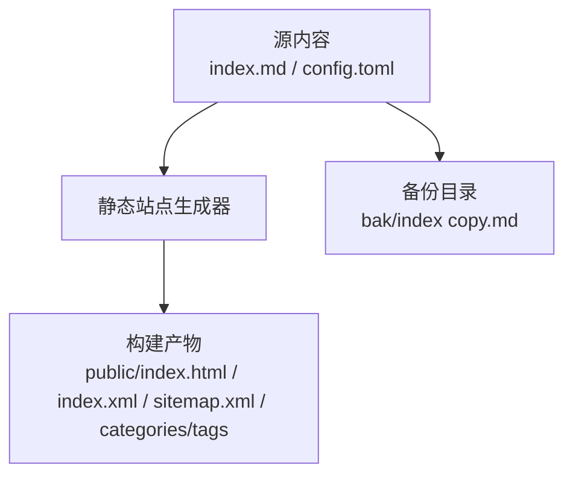
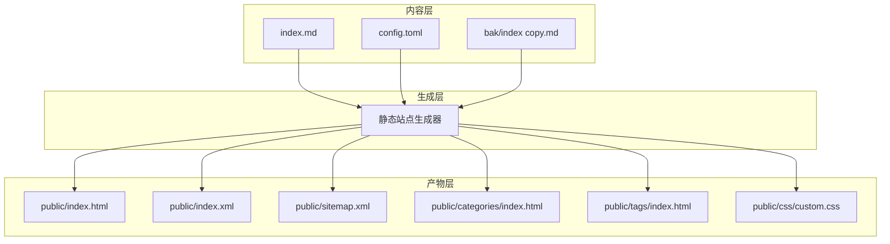
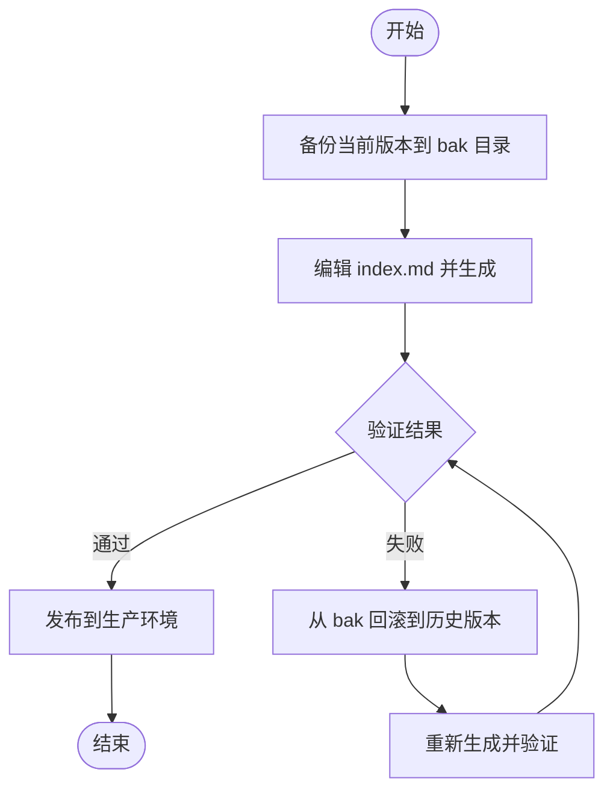
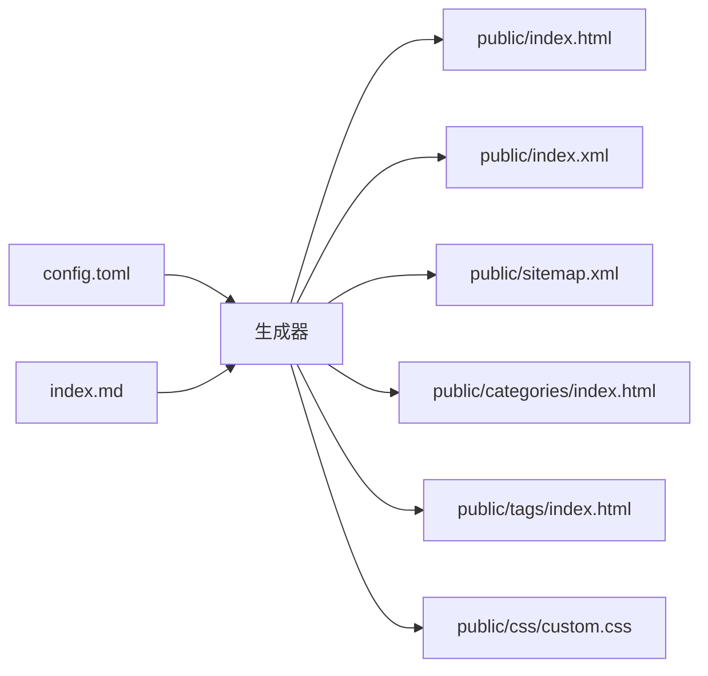

# 内容管理

<cite>
**本文引用的文件**
- [index.md](file://index.md)
- [bak/index copy.md](file://bak/index copy.md)
- [config.toml](file://config.toml)
- [public/index.html](file://public/index.html)
- [public/categories/index.html](file://public/categories/index.html)
- [public/tags/index.html](file://public/tags/index.html)
- [public/index.xml](file://public/index.xml)
- [public/sitemap.xml](file://public/sitemap.xml)
- [public/css/custom.css](file://public/css/custom.css)
</cite>

## 目录
1. [简介](#简介)
2. [项目结构](#项目结构)
3. [核心组件](#核心组件)
4. [架构总览](#架构总览)
5. [详细组件分析](#详细组件分析)
6. [依赖关系分析](#依赖关系分析)
7. [性能考量](#性能考量)
8. [故障排查指南](#故障排查指南)
9. [结论](#结论)
10. [附录](#附录)

## 简介
本技术文档面向内容管理系统，聚焦于以下目标：
- 解释Markdown内容编写规范（标题层级、列表格式、链接语法等）
- 说明页面结构与组织方式（元数据配置、分类标签使用、内容分组策略）
- 文档化备份与版本管理流程（bak目录作用与版本回滚机制）
- 提供实际内容编辑示例（新增客户端下载链接、更新服务器状态信息、编写FAQ）
- 给出内容验证规则与最佳实践建议

该系统基于静态站点生成器构建，前端模板采用轻量主题，后端通过配置驱动生成HTML、RSS与站点地图等资源。

## 项目结构
仓库采用“源内容 + 构建产物”的典型静态站点布局：
- 源内容：Markdown文档与配置文件
- 构建产物：public目录下的HTML、RSS、站点地图与自定义样式
- 备份目录：bak目录用于历史版本保留与回滚

图表来源
- [index.md:1-52](file://index.md#L1-L52)
- [config.toml:1-8](file://config.toml#L1-L8)
- [public/index.html:1-251](file://public/index.html#L1-L251)
- [public/index.xml:1-12](file://public/index.xml#L1-L12)
- [public/sitemap.xml:1-12](file://public/sitemap.xml#L1-L12)
- [bak/index copy.md:1-51](file://bak/index copy.md#L1-L51)

章节来源
- [index.md:1-52](file://index.md#L1-L52)
- [config.toml:1-8](file://config.toml#L1-L8)
- [public/index.html:1-251](file://public/index.html#L1-L251)
- [public/index.xml:1-12](file://public/index.xml#L1-L12)
- [public/sitemap.xml:1-12](file://public/sitemap.xml#L1-L12)
- [bak/index copy.md:1-51](file://bak/index copy.md#L1-L51)

## 核心组件
- Markdown内容源：index.md承载客户端下载、常见问题等正文内容，采用标准Markdown语法。
- 配置文件：config.toml定义站点基础信息（如baseURL、语言、标题、主题等），用于驱动生成器渲染。
- 构建产物：public目录输出HTML页面、RSS订阅与站点地图，便于SEO与外部聚合。
- 备份目录：bak目录存放历史版本文件，支持版本回滚与变更追踪。

章节来源
- [index.md:1-52](file://index.md#L1-L52)
- [config.toml:1-8](file://config.toml#L1-L8)
- [public/index.html:1-251](file://public/index.html#L1-L251)
- [bak/index copy.md:1-51](file://bak/index copy.md#L1-L51)

## 架构总览
系统采用“内容即代码”的静态站点生成模式：
- 内容作者在index.md中维护正文与元数据
- 配置文件config.toml提供站点级参数
- 生成器读取内容与配置，输出HTML、RSS与sitemap
- 用户通过public目录中的静态页面访问

图表来源
- [index.md:1-52](file://index.md#L1-L52)
- [config.toml:1-8](file://config.toml#L1-L8)
- [bak/index copy.md:1-51](file://bak/index copy.md#L1-L51)
- [public/index.html:1-251](file://public/index.html#L1-L251)
- [public/index.xml:1-12](file://public/index.xml#L1-L12)
- [public/sitemap.xml:1-12](file://public/sitemap.xml#L1-L12)
- [public/categories/index.html:1-247](file://public/categories/index.html#L1-L247)
- [public/tags/index.html:1-247](file://public/tags/index.html#L1-L247)
- [public/css/custom.css:1-11](file://public/css/custom.css#L1-L11)

## 详细组件分析

### Markdown内容编写规范
- 标题层级
  - 使用H2/H3/H4等层级表达模块划分，例如“客户端下载”“专属客户端下载（推荐）”“常见问题 (FAQ)”等。
  - 建议遵循从上至下的层级顺序，避免跨级跳跃。
- 列表格式
  - 有序列表用于步骤类内容（如登录流程编号项）。
  - 无序列表用于列举下载项或FAQ条目。
- 链接语法
  - 使用标准Markdown链接语法，确保URL可访问性与协议正确性。
  - 对于外链，建议在链接文本中明确用途（如“点击下载”）。
- 引用块
  - 使用引用块强调注意事项与提示信息，提升可读性。
- 分割线
  - 使用分割线清晰分隔不同模块，增强视觉层次。

章节来源
- [index.md:1-52](file://index.md#L1-L52)

### 页面结构与组织方式
- HTML页面结构
  - 页面头部包含SEO元信息、Open Graph与Twitter Card等，便于社交分享与搜索引擎收录。
  - 主体部分包含标题、通知与重要提示等信息，适合放置动态更新内容。
- 分类与标签
  - 系统提供categories与tags页面入口，但当前页面显示“暂无文章”，表明未启用博客型内容组织。
  - 若未来引入带分类/标签的博文，可通过front matter声明分类与标签，实现内容分组与检索。
- RSS与站点地图
  - RSS通道包含站点标题、语言与自描述信息，便于订阅。
  - 站点地图列出主要页面链接，辅助搜索引擎抓取。

章节来源
- [public/index.html:1-251](file://public/index.html#L1-L251)
- [public/categories/index.html:1-247](file://public/categories/index.html#L1-L247)
- [public/tags/index.html:1-247](file://public/tags/index.html#L1-L247)
- [public/index.xml:1-12](file://public/index.xml#L1-L12)
- [public/sitemap.xml:1-12](file://public/sitemap.xml#L1-L12)

### 备份与版本管理流程
- bak目录的作用
  - 存放历史版本的Markdown文件，便于对比差异与回滚。
  - 建议每次重大修改前先提交当前版本到bak目录，命名包含时间戳或版本号。
- 版本回滚机制
  - 当发现新版本存在错误时，可将bak中的历史版本复制回index.md，重新触发生成流程。
  - 回滚后检查public目录是否同步更新，必要时清理缓存或重启本地预览服务。

图表来源
- [bak/index copy.md:1-51](file://bak/index copy.md#L1-L51)
- [index.md:1-52](file://index.md#L1-L52)

章节来源
- [bak/index copy.md:1-51](file://bak/index copy.md#L1-L51)
- [index.md:1-52](file://index.md#L1-L52)

### 实际内容编辑示例

#### 示例一：添加新的客户端下载链接
- 在“专属客户端下载（推荐）”模块下新增一项，使用有序列表编号，确保步骤清晰。
- 使用标准Markdown链接语法，提供简短描述与可点击的下载地址。
- 在链接下方补充必要的注意事项（如系统要求、路径限制等）。

章节来源
- [index.md:9-32](file://index.md#L9-L32)

#### 示例二：更新服务器状态信息
- 在页面主体区域追加“重要通知”段落，使用有序列表记录多次更新时间与事件摘要。
- 保持语言简洁、重点突出，便于用户快速获取最新状态。

章节来源
- [public/index.html:211-224](file://public/index.html#L211-L224)

#### 示例三：编写FAQ内容
- 在“常见问题 (FAQ)”模块下使用无序列表逐条列举问题与解答。
- 对于复杂步骤，使用有序编号列表拆解流程，确保用户可按顺序执行。

章节来源
- [index.md:34-41](file://index.md#L34-L41)

### 内容验证规则与最佳实践
- 内容验证规则
  - 链接有效性：确保所有外链可访问且协议正确（HTTP/HTTPS）。
  - 标题层级一致性：避免跨级使用标题，保持层级递减。
  - 列表完整性：步骤类内容应使用有序列表，FAQ使用无序列表。
  - 引用块规范：仅用于提示与注意事项，避免滥用。
- 最佳实践建议
  - 采用模块化结构：每个功能模块独立成段，使用分割线分隔。
  - 语义化命名：文件名与目录名尽量体现内容类型，便于维护。
  - 版本控制：每次重大修改前先备份到bak目录，形成可追溯的历史版本。
  - SEO友好：在HTML头部维护标题、描述与关键词，提升搜索引擎可见性。

章节来源
- [index.md:1-52](file://index.md#L1-L52)
- [public/index.html:1-251](file://public/index.html#L1-L251)

## 依赖关系分析
- 配置驱动
  - config.toml中的站点参数影响生成器渲染，如baseURL决定资源链接与RSS地址。
- 内容与模板
  - index.md作为主内容源，经生成器渲染为public/index.html。
- 资源依赖
  - public目录下的HTML、RSS、sitemap与categories/tags页面相互关联，共同构成站点导航与聚合入口。
  - 自定义样式custom.css在深色模式下覆盖默认配色，提升可读性。

图表来源
- [config.toml:1-8](file://config.toml#L1-L8)
- [index.md:1-52](file://index.md#L1-L52)
- [public/index.html:1-251](file://public/index.html#L1-L251)
- [public/index.xml:1-12](file://public/index.xml#L1-L12)
- [public/sitemap.xml:1-12](file://public/sitemap.xml#L1-L12)
- [public/categories/index.html:1-247](file://public/categories/index.html#L1-L247)
- [public/tags/index.html:1-247](file://public/tags/index.html#L1-L247)
- [public/css/custom.css:1-11](file://public/css/custom.css#L1-L11)

章节来源
- [config.toml:1-8](file://config.toml#L1-L8)
- [index.md:1-52](file://index.md#L1-L52)
- [public/index.html:1-251](file://public/index.html#L1-L251)
- [public/index.xml:1-12](file://public/index.xml#L1-L12)
- [public/sitemap.xml:1-12](file://public/sitemap.xml#L1-L12)
- [public/categories/index.html:1-247](file://public/categories/index.html#L1-L247)
- [public/tags/index.html:1-247](file://public/tags/index.html#L1-L247)
- [public/css/custom.css:1-11](file://public/css/custom.css#L1-L11)

## 性能考量
- 静态资源优化
  - HTML与CSS均为静态文件，无需服务器端处理，加载速度快。
  - 自定义CSS在深色模式下减少渲染负担，提升用户体验。
- 生成效率
  - 生成器一次性渲染所有页面，部署后无需数据库查询，响应迅速。
- 可扩展性
  - 若未来引入博客型内容，建议控制每页博文数量与图片大小，避免影响加载性能。

## 故障排查指南
- 页面空白或样式异常
  - 检查public/css/custom.css是否正确加载，确认深色模式下的配色覆盖生效。
- RSS与站点地图异常
  - 校验public/index.xml与public/sitemap.xml的结构与字段，确保语言与链接正确。
- 分类与标签页面为空
  - 当前categories/tags页面显示“暂无文章”，属于预期状态；若启用博客内容，需在front matter中声明分类与标签。
- 备份回滚失败
  - 确认bak目录中的历史版本已复制回index.md，重新触发生成流程并验证public目录更新。

章节来源
- [public/css/custom.css:1-11](file://public/css/custom.css#L1-L11)
- [public/index.xml:1-12](file://public/index.xml#L1-L12)
- [public/sitemap.xml:1-12](file://public/sitemap.xml#L1-L12)
- [public/categories/index.html:1-247](file://public/categories/index.html#L1-L247)
- [public/tags/index.html:1-247](file://public/tags/index.html#L1-L247)
- [bak/index copy.md:1-51](file://bak/index copy.md#L1-L51)

## 结论
本内容管理系统以Markdown为核心，结合配置驱动的静态站点生成，实现了简洁高效的发布流程。通过规范化的编写规范、完善的备份与回滚机制以及清晰的页面组织方式，能够稳定支撑客户端下载、FAQ与动态状态信息等内容的维护与发布。建议持续遵循内容验证规则与最佳实践，确保内容质量与用户体验。

## 附录
- 快速参考
  - 标题层级：H2/H3/H4等，避免跨级使用
  - 列表格式：步骤类用有序列表，FAQ用无序列表
  - 链接语法：使用标准Markdown链接，提供简短描述
  - 引用块：仅用于提示与注意事项
  - 备份策略：每次重大修改前备份到bak目录