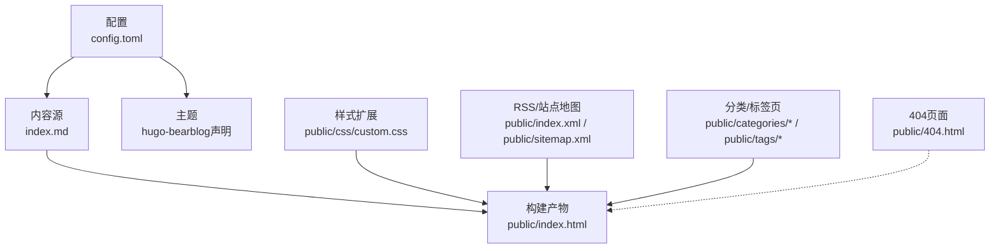
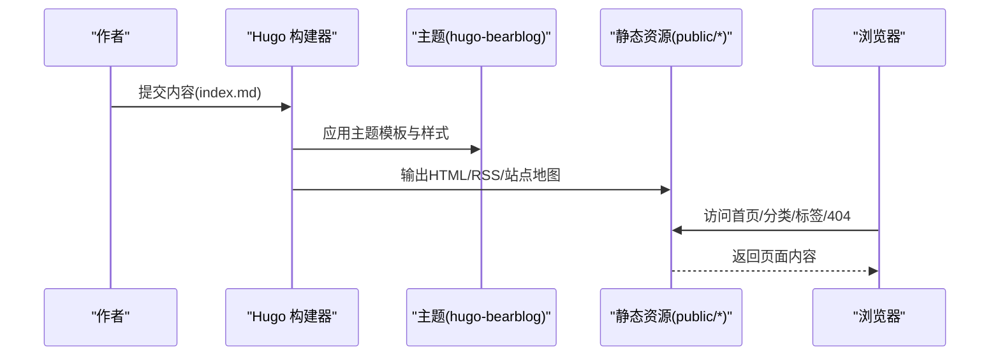
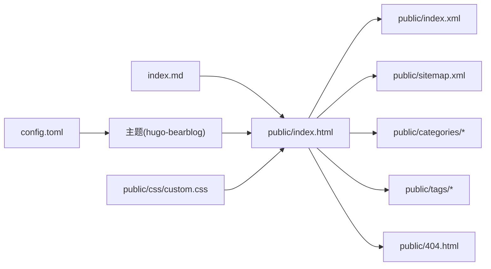

# 故障排除

<cite>
**本文引用的文件**
- [config.toml](file://config.toml)
- [index.md](file://index.md)
- [public/index.html](file://public/index.html)
- [public/404.html](file://public/404.html)
- [public/css/custom.css](file://public/css/custom.css)
- [public/index.xml](file://public/index.xml)
- [public/sitemap.xml](file://public/sitemap.xml)
- [public/categories/index.html](file://public/categories/index.html)
- [public/tags/index.html](file://public/tags/index.html)
- [public/categories/index.xml](file://public/categories/index.xml)
</cite>

## 目录
1. [简介](#简介)
2. [项目结构](#项目结构)
3. [核心组件](#核心组件)
4. [架构总览](#架构总览)
5. [详细组件分析](#详细组件分析)
6. [依赖关系分析](#依赖关系分析)
7. [性能考虑](#性能考虑)
8. [故障排除指南](#故障排除指南)
9. [结论](#结论)
10. [附录](#附录)

## 简介
本指南面向维护者与运维人员，聚焦于该Hugo站点在实际运行中的常见问题与系统化排查流程，涵盖构建错误、主题显示异常、下载链接失效、404页面体验优化、性能优化与维护最佳实践。文档以仓库现有产物为依据，结合静态站点生成与部署特性，提供可操作的定位与修复建议。

## 项目结构
该站点采用单页发布页模式，核心内容由Markdown驱动，通过Hugo生成静态HTML与RSS/站点地图等辅助资源。关键位置如下：
- 配置入口：站点基础信息与主题声明位于根目录配置文件
- 内容源：Markdown文档用于生成页面与下载指引
- 构建产物：public目录包含首页、404页、分类/标签页、样式与RSS/站点地图
- 主题来源：主题名称在配置中声明，但主题目录未在仓库中出现，需确认外部主题来源或本地主题存在性

图表来源
- [config.toml](file://config.toml)
- [index.md](file://index.md)
- [public/index.html](file://public/index.html)
- [public/css/custom.css](file://public/css/custom.css)
- [public/index.xml](file://public/index.xml)
- [public/sitemap.xml](file://public/sitemap.xml)
- [public/categories/index.html](file://public/categories/index.html)
- [public/tags/index.html](file://public/tags/index.html)
- [public/categories/index.xml](file://public/categories/index.xml)

章节来源
- [config.toml](file://config.toml)
- [index.md](file://index.md)
- [public/index.html](file://public/index.html)
- [public/404.html](file://public/404.html)
- [public/css/custom.css](file://public/css/custom.css)
- [public/index.xml](file://public/index.xml)
- [public/sitemap.xml](file://public/sitemap.xml)
- [public/categories/index.html](file://public/categories/index.html)
- [public/tags/index.html](file://public/tags/index.html)
- [public/categories/index.xml](file://public/categories/index.xml)

## 核心组件
- 站点配置：定义基础URL、语言、标题与主题，以及可选的自定义CSS参数占位
- 内容源：Markdown文档承载下载链接与FAQ，是页面内容的主要来源
- 构建产物：首页、404页、分类/标签页、RSS与站点地图，均以静态HTML/XML形式输出
- 样式扩展：自定义CSS用于深色模式适配，影响主题默认样式
- 辅助资源：RSS与站点地图用于SEO与索引

章节来源
- [config.toml](file://config.toml)
- [index.md](file://index.md)
- [public/index.html](file://public/index.html)
- [public/404.html](file://public/404.html)
- [public/css/custom.css](file://public/css/custom.css)
- [public/index.xml](file://public/index.xml)
- [public/sitemap.xml](file://public/sitemap.xml)

## 架构总览
下图展示从内容到最终页面的关键流转：内容源经Hugo处理，结合主题与样式，生成HTML与辅助资源；用户请求通过基础URL访问；404页作为兜底页面参与用户体验闭环。

图表来源
- [config.toml](file://config.toml)
- [index.md](file://index.md)
- [public/index.html](file://public/index.html)
- [public/404.html](file://public/404.html)
- [public/index.xml](file://public/index.xml)
- [public/sitemap.xml](file://public/sitemap.xml)

## 详细组件分析

### 首页（public/index.html）
- 页面包含站点标题、描述、Open Graph与Twitter Card元数据，以及内置的在线客服脚本
- 内容区域展示“当前可用地址”“重要通知”“常见问题”等信息
- 若发现页面空白或样式异常，优先检查主题注入的样式与自定义CSS是否生效

章节来源
- [public/index.html](file://public/index.html)

### 404页面（public/404.html）
- 包含基础样式、深色模式变量、导航与页脚
- 内嵌在线客服脚本，便于用户在异常路径时快速联系
- 若出现路径不一致或资源加载失败，检查基础URL与静态资源相对路径

章节来源
- [public/404.html](file://public/404.html)

### 分类/标签页（public/categories/* 与 public/tags/*）
- 生成了分类与标签列表页，当前无内容项
- 若期望显示内容，请确认内容源中是否存在对应字段或分组逻辑

章节来源
- [public/categories/index.html](file://public/categories/index.html)
- [public/tags/index.html](file://public/tags/index.html)

### RSS与站点地图（public/index.xml 与 public/sitemap.xml）
- RSS通道包含站点标题、语言与自链接
- 站点地图包含分类、标签与首页链接
- 若搜索引擎收录异常，检查基础URL与XML输出是否与部署环境一致

章节来源
- [public/index.xml](file://public/index.xml)
- [public/sitemap.xml](file://public/sitemap.xml)

### 自定义样式（public/css/custom.css）
- 通过媒体查询为深色模式提供背景与链接颜色覆盖
- 若主题样式被覆盖或未生效，检查样式加载顺序与选择器优先级

章节来源
- [public/css/custom.css](file://public/css/custom.css)

### 配置（config.toml）
- 基础URL指向生产域名，语言为简体中文，标题与主题已声明
- 自定义CSS参数处于注释状态，如需启用请取消注释并确保路径正确

章节来源
- [config.toml](file://config.toml)

## 依赖关系分析
- 主题依赖：配置中声明主题名称，但仓库未包含主题目录，需确保主题在构建环境中可用
- 资源依赖：页面内联样式与外链脚本依赖基础URL与静态资源路径
- SEO依赖：RSS与站点地图依赖正确的基础URL与语言设置

图表来源
- [config.toml](file://config.toml)
- [index.md](file://index.md)
- [public/index.html](file://public/index.html)
- [public/css/custom.css](file://public/css/custom.css)
- [public/index.xml](file://public/index.xml)
- [public/sitemap.xml](file://public/sitemap.xml)
- [public/categories/index.html](file://public/categories/index.html)
- [public/tags/index.html](file://public/tags/index.html)
- [public/404.html](file://public/404.html)

章节来源
- [config.toml](file://config.toml)
- [index.md](file://index.md)
- [public/index.html](file://public/index.html)
- [public/css/custom.css](file://public/css/custom.css)
- [public/index.xml](file://public/index.xml)
- [public/sitemap.xml](file://public/sitemap.xml)
- [public/categories/index.html](file://public/categories/index.html)
- [public/tags/index.html](file://public/tags/index.html)
- [public/404.html](file://public/404.html)

## 性能考虑
- 资源体积控制
  - 合并与压缩CSS/JS：若引入额外脚本，建议在构建阶段进行压缩与去重
  - 图片优化：对页面中使用的图片进行格式优化与尺寸裁剪
- 缓存策略
  - 静态资源设置长缓存（如CSS/字体），HTML设置较短缓存或协商缓存
  - 利用HTTP缓存头与版本化资源名减少重复传输
- 构建优化
  - 关闭不必要的Hugo功能（如不使用的分页/分组），缩短构建时间
  - 在CI中预热依赖，避免首次构建过慢
- 用户体验
  - 首屏渲染：优先保证关键CSS内联，非关键CSS异步加载
  - 404页面友好化：保持简洁文案与返回入口，降低跳出率

## 故障排除指南

### 1. 构建错误与主题显示异常
- 症状
  - 构建失败或主题缺失导致页面空白
  - 样式错乱或自定义CSS未生效
- 排查步骤
  - 确认主题名称与主题目录匹配，或确保外部主题可用
  - 检查自定义CSS路径与加载顺序，必要时移除或修正参数
  - 对比生成的HTML与预期差异，定位具体模块
- 参考文件
  - [config.toml](file://config.toml)
  - [public/index.html](file://public/index.html)
  - [public/css/custom.css](file://public/css/custom.css)

章节来源
- [config.toml](file://config.toml)
- [public/index.html](file://public/index.html)
- [public/css/custom.css](file://public/css/custom.css)

### 2. 下载链接失效
- 症状
  - 客户端下载链接无法访问或返回错误
- 排查步骤
  - 核对Markdown源中的链接有效性，优先验证直连地址
  - 检查代理/镜像服务状态，必要时切换备用链接
  - 在页面中增加“失效反馈”入口，收集用户反馈
- 参考文件
  - [index.md](file://index.md)
  - [public/index.html](file://public/index.html)

章节来源
- [index.md](file://index.md)
- [public/index.html](file://public/index.html)

### 3. 基础URL与资源路径问题
- 症状
  - 静态资源404、OG/Twitter卡片路径异常
- 排查步骤
  - 确认配置中的基础URL与实际部署域名一致
  - 检查HTML中相对路径与绝对路径的使用一致性
  - 在本地预览时使用与生产相同的端口/路径，避免相对路径偏差
- 参考文件
  - [config.toml](file://config.toml)
  - [public/index.html](file://public/index.html)
  - [public/404.html](file://public/404.html)

章节来源
- [config.toml](file://config.toml)
- [public/index.html](file://public/index.html)
- [public/404.html](file://public/404.html)

### 4. 分类/标签页为空
- 症状
  - 访问分类/标签页显示“暂无文章”
- 排查步骤
  - 确认内容源中是否存在对应字段或分组标记
  - 检查Hugo配置中是否启用了相关功能（如taxonomy）
  - 重新构建并核验生成的HTML与RSS输出
- 参考文件
  - [public/categories/index.html](file://public/categories/index.html)
  - [public/tags/index.html](file://public/tags/index.html)
  - [public/categories/index.xml](file://public/categories/index.xml)

章节来源
- [public/categories/index.html](file://public/categories/index.html)
- [public/tags/index.html](file://public/tags/index.html)
- [public/categories/index.xml](file://public/categories/index.xml)

### 5. RSS/站点地图异常
- 症状
  - RSS无法订阅或站点地图收录异常
- 排查步骤
  - 校验基础URL与语言设置，确保与页面一致
  - 检查XML输出是否包含有效链接与自链接
  - 使用搜索引擎工具测试sitemap与RSS可用性
- 参考文件
  - [public/index.xml](file://public/index.xml)
  - [public/sitemap.xml](file://public/sitemap.xml)

章节来源
- [public/index.xml](file://public/index.xml)
- [public/sitemap.xml](file://public/sitemap.xml)

### 6. 404页面体验优化
- 当前现状
  - 404页包含基础样式与在线客服脚本，具备返回入口
- 优化建议
  - 增加“返回首页”“搜索建议”等引导
  - 保持与主站一致的配色与排版，避免视觉割裂
  - 可考虑加入最近热门内容或常见问题入口
- 参考文件
  - [public/404.html](file://public/404.html)

章节来源
- [public/404.html](file://public/404.html)

### 7. 调试方法与工具使用
- 本地预览
  - 使用Hugo内置服务器进行本地校验，关注构建日志与页面渲染结果
- 浏览器调试
  - 检查网络面板中的资源加载情况与错误码
  - 使用开发者工具审查元素，定位样式冲突与脚本错误
- SEO检测
  - 使用搜索引擎自带的站点验证工具检查sitemap与RSS可用性
  - 核对OG/Twitter卡片元数据是否正确渲染

## 结论
本指南基于仓库现有产物，梳理了从配置、内容到构建产物的全链路问题定位方法，并提供了针对下载链接、基础URL、RSS/站点地图与404页面的具体优化建议。建议在日常维护中建立“变更—预览—校验—上线”的标准化流程，配合自动化校验与监控，持续保障站点稳定性与用户体验。

## 附录

### A. 常见问题与解决方案清单
- 主题缺失或样式异常：检查主题声明与可用性，必要时回退至默认主题或修正参数
- 自定义CSS不生效：确认路径与加载顺序，避免选择器优先级冲突
- 下载链接失效：优先验证直连地址，补充备用链接与反馈入口
- 基础URL不一致：统一配置与部署域名，避免相对路径问题
- 分类/标签为空：确认内容源字段与Hugo配置，重新构建核验
- RSS/站点地图异常：校验基础URL与语言设置，使用工具测试可用性
- 404页面体验差：增加返回入口与引导，保持风格一致

### B. 维护最佳实践
- 定期更新检查：跟踪Hugo版本与主题更新，评估兼容性与风险
- 安全补丁应用：关注主题与第三方脚本的安全公告，及时升级
- 备份策略：保留关键配置与内容源，定期导出构建产物与RSS/站点地图
- 发布流程：建立“预发布—灰度—全量”的发布节奏，记录每次变更