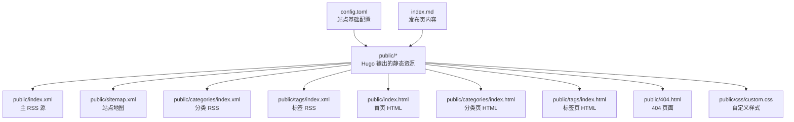
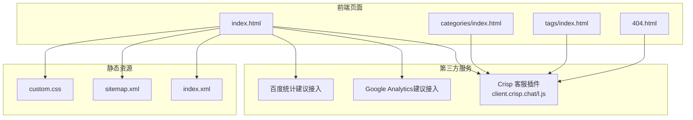
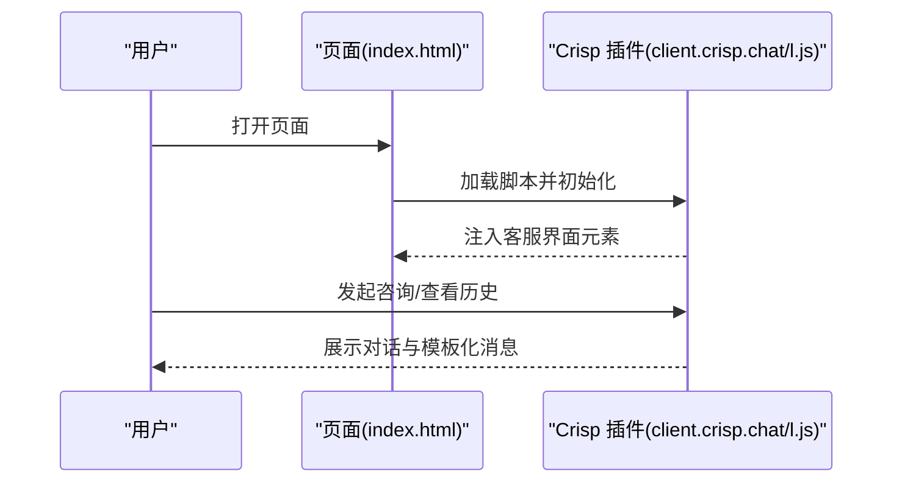
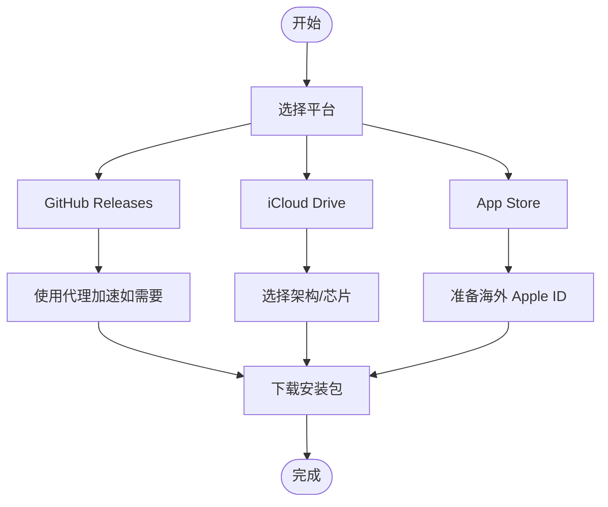
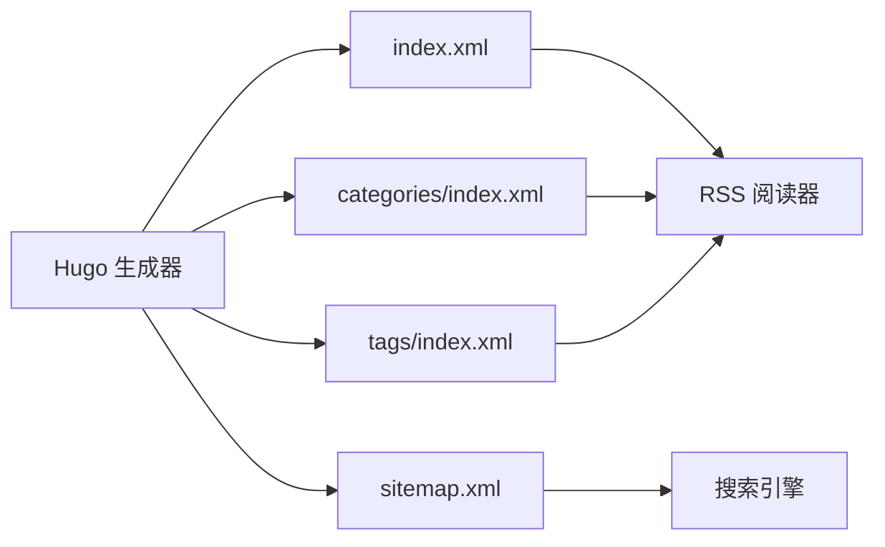
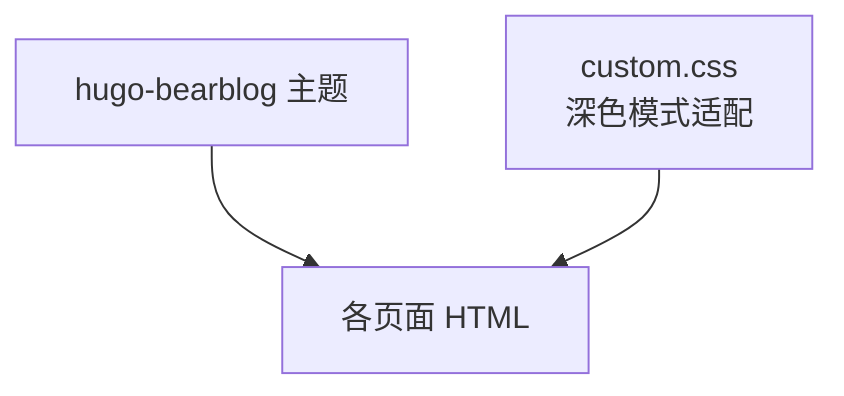
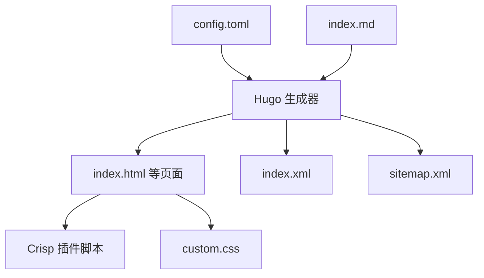

# 第三方集成

<cite>
**本文引用的文件**
- [config.toml](file://config.toml)
- [index.md](file://index.md)
- [index.html](file://public/index.html)
- [index.xml](file://public/index.xml)
- [sitemap.xml](file://public/sitemap.xml)
- [categories/index.xml](file://public/categories/index.xml)
- [tags/index.xml](file://public/tags/index.xml)
- [custom.css](file://public/css/custom.css)
- [categories/index.html](file://public/categories/index.html)
- [tags/index.html](file://public/tags/index.html)
- [404.html](file://public/404.html)
- [index copy.html](file://index copy.html)
</cite>

## 目录
1. [简介](#简介)
2. [项目结构](#项目结构)
3. [核心组件](#核心组件)
4. [架构总览](#架构总览)
5. [详细组件分析](#详细组件分析)
6. [依赖关系分析](#依赖关系分析)
7. [性能考量](#性能考量)
8. [故障排查指南](#故障排查指南)
9. [结论](#结论)
10. [附录](#附录)

## 简介
本文件聚焦于本项目的第三方集成实践，围绕以下目标展开：
- Crisp 聊天系统的集成配置：包括 API 密钥设置、客服功能启用、消息模板定制。
- 外部下载源的配置方法：涵盖 GitHub Releases、iCloud Drive、App Store 等平台的链接设置与注意事项。
- RSS 订阅与 SEO 优化：解释 sitemap.xml 与 index.xml 的作用及配置要点。
- 分析工具集成指南：提供 Google Analytics、百度统计等分析工具的接入建议与注意事项。
- 安全与隐私保护：在第三方集成中确保安全性与合规性的策略与最佳实践。

本项目基于静态站点生成器构建，前端页面通过内嵌脚本或静态资源引入第三方服务，整体以轻量、可维护为目标。

## 项目结构
项目采用静态站点组织方式，核心内容与配置如下：
- 根配置：通过配置文件统一管理基础参数与可选扩展。
- 内容页：Markdown 文档作为发布页内容来源。
- 公共输出：Hugo 生成的 HTML、RSS、Sitemap 等静态资源。
- 主题与样式：主题为 hugo-bearblog，自定义 CSS 用于深色模式适配。

图表来源
- [config.toml](file://config.toml)
- [index.md](file://index.md)
- [index.xml](file://public/index.xml)
- [sitemap.xml](file://public/sitemap.xml)
- [categories/index.xml](file://public/categories/index.xml)
- [tags/index.xml](file://public/tags/index.xml)
- [index.html](file://public/index.html)
- [categories/index.html](file://public/categories/index.html)
- [tags/index.html](file://public/tags/index.html)
- [404.html](file://public/404.html)
- [custom.css](file://public/css/custom.css)

章节来源
- [config.toml](file://config.toml)
- [index.md](file://index.md)

## 核心组件
- Crisp 聊天系统：在多个页面中内嵌脚本加载 Crisp 客服插件，使用站点标识进行初始化。
- 下载源配置：在 Markdown 内容中直接提供各平台下载链接，并附带使用提示与注意事项。
- RSS 与 Sitemap：由 Hugo 自动生成，分别用于内容订阅与搜索引擎索引。
- 自定义样式：通过自定义 CSS 实现深色模式适配，提升用户体验。

章节来源
- [index.html](file://public/index.html)
- [index copy.html](file://index copy.html)
- [index.md](file://index.md)
- [index.xml](file://public/index.xml)
- [sitemap.xml](file://public/sitemap.xml)
- [custom.css](file://public/css/custom.css)

## 架构总览
下图展示第三方集成在页面中的位置与交互关系：

图表来源
- [index.html](file://public/index.html)
- [categories/index.html](file://public/categories/index.html)
- [tags/index.html](file://public/tags/index.html)
- [404.html](file://public/404.html)
- [index.xml](file://public/index.xml)
- [sitemap.xml](file://public/sitemap.xml)
- [custom.css](file://public/css/custom.css)

## 详细组件分析

### Crisp 聊天系统集成
- 集成方式：在多个页面的头部或底部注入脚本，加载 Crisp 客服插件，并设置站点标识。
- 启用范围：首页、分类页、标签页、404 页面均包含该脚本，确保全站客服入口一致。
- API 密钥设置：站点标识在脚本中以全局变量形式配置，对应 Crisp 网站 ID。
- 消息模板定制：可在 Crisp 控制台进行模板配置与个性化设置，本仓库未包含相关模板文件。

图表来源
- [index.html](file://public/index.html)
- [index copy.html](file://index copy.html)

章节来源
- [index.html](file://public/index.html)
- [index copy.html](file://index copy.html)

### 外部下载源配置
- GitHub Releases：提供直链下载，配合代理地址以改善部分地区访问体验。
- iCloud Drive：提供 macOS/iOS 平台下载链接，包含不同芯片与架构版本。
- App Store：提供应用商店直达链接，并提示需提前准备海外 Apple ID。
- 备用客户端：当专属客户端不可用时，提供多平台备用下载选项。

图表来源
- [index.md](file://index.md)

章节来源
- [index.md](file://index.md)

### RSS 订阅与 SEO 优化
- RSS 源：Hugo 自动生成主 RSS 与分类/标签 RSS，便于内容订阅与聚合。
- Sitemap：Hugo 自动生成站点地图，帮助搜索引擎收录页面。
- SEO 元数据：页面包含标题、描述、Open Graph、Twitter Card 等元信息，提升分享与索引质量。
- 参考路径：主 RSS、分类 RSS、标签 RSS 与站点地图均位于 public 目录。

图表来源
- [index.xml](file://public/index.xml)
- [categories/index.xml](file://public/categories/index.xml)
- [tags/index.xml](file://public/tags/index.xml)
- [sitemap.xml](file://public/sitemap.xml)

章节来源
- [index.xml](file://public/index.xml)
- [categories/index.xml](file://public/categories/index.xml)
- [tags/index.xml](file://public/tags/index.xml)
- [sitemap.xml](file://public/sitemap.xml)

### 分析工具集成指南
- Google Analytics：建议在页面中添加官方 Analytics 脚本，用于统计访问量、用户行为等。
- 百度统计：如需覆盖国内用户统计，可在页面中添加百度统计脚本。
- 接入位置：建议放置于页面头部或尾部，确保在页面加载早期执行。
- 数据隐私：接入前应明确隐私政策与数据处理规则，确保符合相关法律法规。

[本节为通用指导，不直接分析具体文件]

### 自定义样式与主题
- 主题：使用 hugo-bearblog，具备简洁风格与良好可读性。
- 自定义 CSS：通过自定义样式实现深色模式适配，提升夜间阅读体验。
- 样式文件：位于 public/css/custom.css，可按需扩展。

图表来源
- [custom.css](file://public/css/custom.css)
- [index.html](file://public/index.html)

章节来源
- [custom.css](file://public/css/custom.css)
- [index.html](file://public/index.html)

## 依赖关系分析
- 页面对第三方服务的依赖：所有页面均依赖 Crisp 插件；部分页面依赖 RSS/Sitemap；首页依赖自定义样式。
- 生成器与输出：Hugo 依据配置与内容生成静态资源，RSS/Sitemap 由框架内置能力生成。
- 资源耦合：页面与脚本、样式之间存在直接耦合，更新时需保持一致性。

图表来源
- [config.toml](file://config.toml)
- [index.md](file://index.md)
- [index.html](file://public/index.html)
- [index.xml](file://public/index.xml)
- [sitemap.xml](file://public/sitemap.xml)
- [custom.css](file://public/css/custom.css)

章节来源
- [config.toml](file://config.toml)
- [index.md](file://index.md)

## 性能考量
- 脚本加载：Crisp 插件异步加载，减少对首屏渲染的影响。
- 资源体积：静态资源体积小，适合快速加载；可结合 CDN 进一步优化。
- 缓存策略：合理设置缓存头与版本控制，避免缓存导致的脚本更新不生效。
- 代理链路：GitHub 下载可借助代理，但需关注代理稳定性与速度。

[本节提供一般性建议，不直接分析具体文件]

## 故障排查指南
- Crisp 无法显示：检查站点标识是否正确、网络是否可达、浏览器是否拦截脚本。
- 下载链接失效：确认平台链接有效性与账号权限；iOS 需确保海外 Apple ID 已切换。
- RSS/Sitemap 未更新：确认内容变更已触发重新生成；检查生成器配置。
- 404 页面异常：核对页面结构与脚本注入位置，确保错误页也能加载第三方脚本。
- 样式异常：检查自定义 CSS 是否被覆盖或缓存未刷新。

章节来源
- [index.html](file://public/index.html)
- [categories/index.html](file://public/categories/index.html)
- [tags/index.html](file://public/tags/index.html)
- [404.html](file://public/404.html)
- [index.xml](file://public/index.xml)
- [sitemap.xml](file://public/sitemap.xml)
- [custom.css](file://public/css/custom.css)

## 结论
本项目在第三方集成方面采取了轻量且可维护的策略：通过在页面中注入 Crisp 插件实现全站客服入口；在内容中直接提供多平台下载链接并标注注意事项；利用 Hugo 自动生成 RSS 与 Sitemap，完善 SEO 与订阅能力；并通过自定义样式增强用户体验。建议在后续迭代中补充分析工具接入与隐私合规流程，进一步提升安全性与数据治理水平。

[本节为总结性内容，不直接分析具体文件]

## 附录
- 配置参考：站点基础参数位于配置文件中，可据此调整站点信息与主题设置。
- 内容参考：发布页内容位于 Markdown 文件中，可据此增删下载源与说明文字。
- 输出参考：静态资源位于 public 目录，可据此校验生成结果与部署状态。

章节来源
- [config.toml](file://config.toml)
- [index.md](file://index.md)
- [index.html](file://public/index.html)