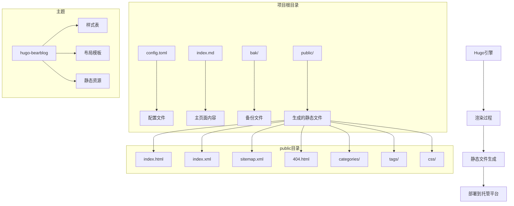
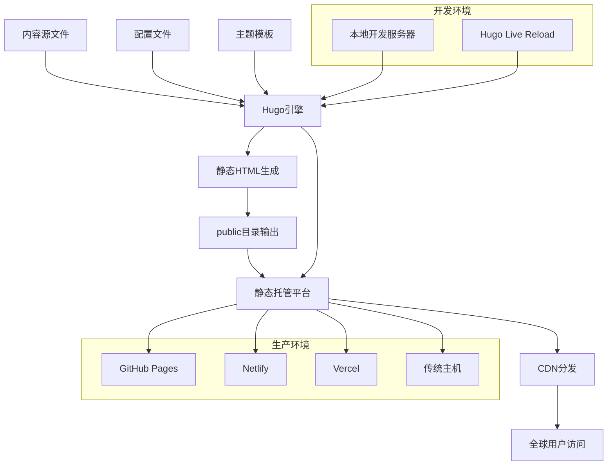
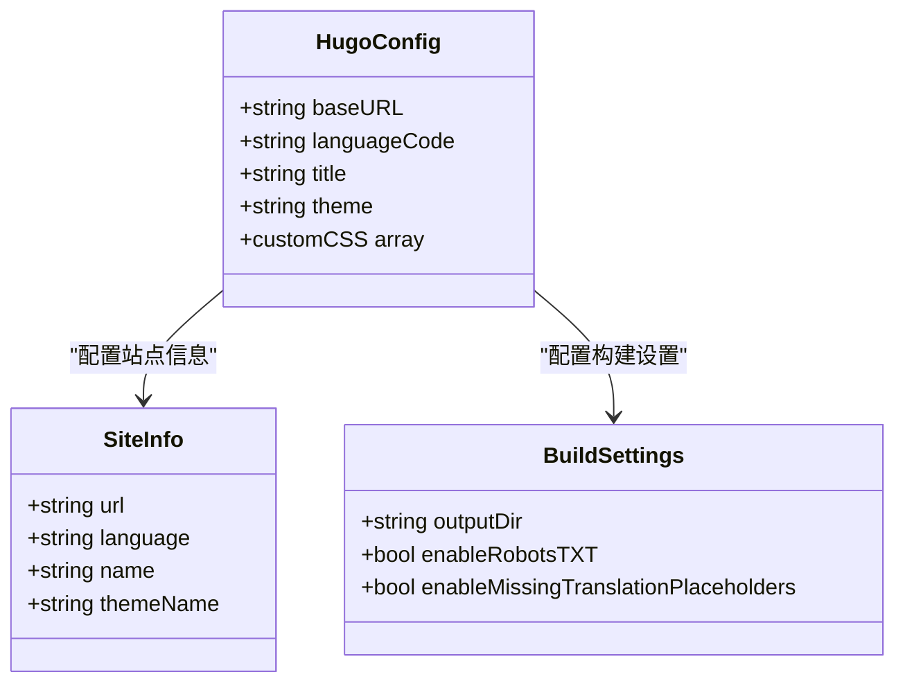
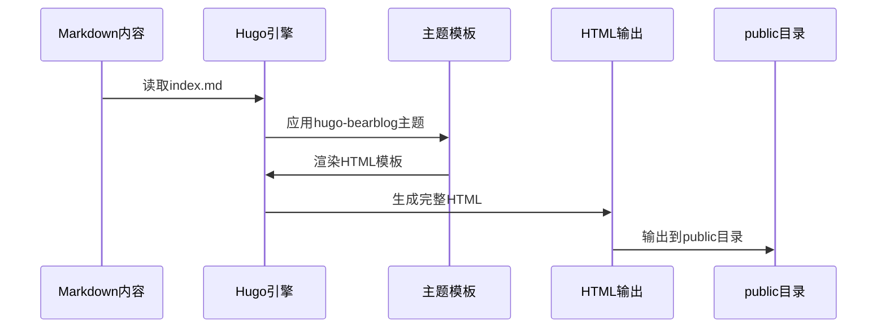
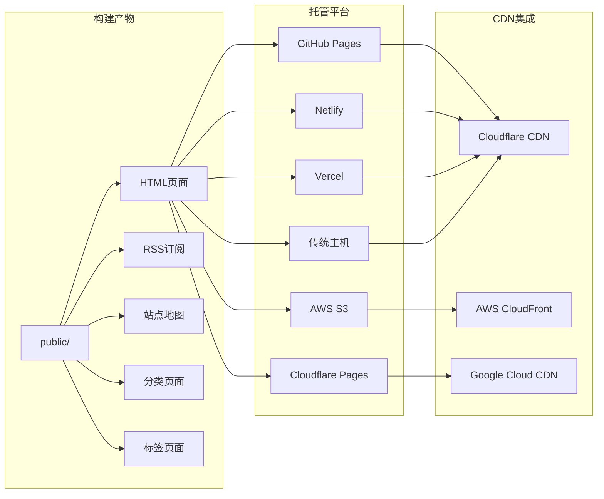
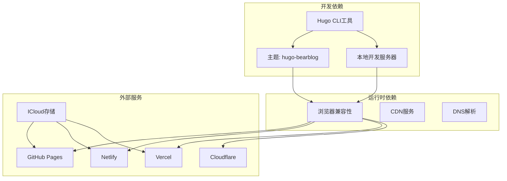

# 部署指南

<cite>
**本文档引用的文件**
- [config.toml](file://config.toml)
- [index.md](file://index.md)
- [public/index.html](file://public/index.html)
- [public/index.xml](file://public/index.xml)
- [bak/index copy.md](file://bak/index copy.md)
</cite>

## 目录
1. [简介](#简介)
2. [项目结构](#项目结构)
3. [核心组件](#核心组件)
4. [架构概览](#架构概览)
5. [详细组件分析](#详细组件分析)
6. [依赖关系分析](#依赖关系分析)
7. [性能考虑](#性能考虑)
8. [故障排除指南](#故障排除指南)
9. [结论](#结论)

## 简介

这是一个基于Hugo静态站点生成器的发布页面项目。该项目用于发布客户端下载地址和相关信息，包含多个平台的客户端下载链接、常见问题解答以及备用客户端选项。项目采用Hugo主题"hugo-bearblog"，通过静态HTML文件进行部署。

## 项目结构

该项目采用标准的Hugo项目结构，主要包含以下关键目录和文件：

**图表来源**
- [config.toml:1-8](file://config.toml#L1-L8)
- [public/index.html:1-251](file://public/index.html#L1-L251)

**章节来源**
- [config.toml:1-8](file://config.toml#L1-L8)
- [public/index.html:1-251](file://public/index.html#L1-L251)

## 核心组件

### 配置管理
项目的核心配置由`config.toml`文件管理，包含基础URL、语言设置、站点标题和主题配置。

### 内容管理
主页面内容存储在`index.md`文件中，包含客户端下载信息、常见问题解答等重要内容。

### 静态资源
生成的静态文件位于`public/`目录，包含HTML页面、RSS订阅、站点地图等。

**章节来源**
- [config.toml:1-8](file://config.toml#L1-L8)
- [index.md:1-52](file://index.md#L1-L52)
- [public/index.html:1-251](file://public/index.html#L1-L251)

## 架构概览

该系统的整体架构基于静态站点生成模式：

**图表来源**
- [config.toml:1-8](file://config.toml#L1-L8)
- [public/index.html:1-251](file://public/index.html#L1-L251)

## 详细组件分析

### Hugo配置组件

Hugo配置文件定义了站点的基本属性和行为：

**图表来源**
- [config.toml:1-8](file://config.toml#L1-L8)

### 内容渲染组件

主页面内容通过Markdown格式编写，经过Hugo主题渲染生成最终的HTML页面：

**图表来源**
- [index.md:1-52](file://index.md#L1-L52)
- [public/index.html:1-251](file://public/index.html#L1-L251)

**章节来源**
- [config.toml:1-8](file://config.toml#L1-L8)
- [index.md:1-52](file://index.md#L1-L52)
- [public/index.html:1-251](file://public/index.html#L1-L251)

### 部署组件

静态站点生成完成后，可以部署到多种托管平台：

**图表来源**
- [public/index.html:1-251](file://public/index.html#L1-L251)
- [public/index.xml:1-12](file://public/index.xml#L1-L12)

## 依赖关系分析

项目的主要依赖关系如下：

**图表来源**
- [config.toml:1-8](file://config.toml#L1-L8)
- [public/index.html:1-251](file://public/index.html#L1-L251)

**章节来源**
- [config.toml:1-8](file://config.toml#L1-L8)
- [public/index.html:1-251](file://public/index.html#L1-L251)

## 性能考虑

### 缓存策略
- **浏览器缓存**: 静态资源应设置长期缓存策略
- **CDN缓存**: 利用CDN的边缘缓存减少延迟
- **HTTP缓存头**: 合理设置Cache-Control和ETag

### 资源优化
- **图片优化**: 使用现代格式如WebP，实现响应式图片
- **CSS优化**: 压缩和合并CSS文件
- **JavaScript优化**: 延迟加载非关键脚本
- **字体优化**: 使用子集化和预加载

### 加载速度优化
- **资源优先级**: 关键资源优先加载
- **连接复用**: 启用HTTP/2和连接复用
- **压缩传输**: 启用Gzip或Brotli压缩
- **异步加载**: 对第三方脚本使用async属性

## 故障排除指南

### 常见部署问题

#### GitHub Pages部署问题
- **检查分支设置**: 确保使用正确的源分支
- **验证CNAME文件**: 如果使用自定义域名，确保CNAME文件正确配置
- **检查工作流**: 验证GitHub Actions工作流配置

#### Netlify部署问题
- **构建命令**: 确保构建命令指向正确的Hugo版本
- **发布目录**: 配置正确的发布目录(public)
- **环境变量**: 检查必要的环境变量设置

#### Vercel部署问题
- **框架检测**: 确保Vercel正确识别Hugo项目
- **构建配置**: 验证vercel.json配置文件
- **域名设置**: 检查自定义域名的DNS配置

### 本地开发问题

#### Live Reload问题
- **端口冲突**: 检查1313端口是否被占用
- **网络配置**: 确保防火墙允许本地连接
- **浏览器缓存**: 清除浏览器缓存以查看最新更改

#### 主题渲染问题
- **主题兼容性**: 确保主题版本与Hugo版本兼容
- **配置验证**: 检查config.toml中的语法错误
- **资源路径**: 验证静态资源的相对路径

**章节来源**
- [public/index.html:1-251](file://public/index.html#L1-L251)
- [config.toml:1-8](file://config.toml#L1-L8)

## 结论

本部署指南提供了完整的静态站点部署解决方案，涵盖了从本地开发到生产部署的全流程。项目基于Hugo静态生成器，具有部署简单、维护成本低的优势。

### 最佳实践建议
1. **版本控制**: 始终将生成的public目录纳入版本控制
2. **自动化部署**: 配置CI/CD管道实现自动化部署
3. **监控和日志**: 设置访问统计和错误监控
4. **备份策略**: 定期备份重要数据和配置文件
5. **安全更新**: 及时更新Hugo版本和主题以获得安全补丁

### 扩展建议
- **多环境配置**: 为不同环境(开发、测试、生产)设置不同的配置
- **A/B测试**: 集成CDN的A/B测试功能
- **性能监控**: 集成性能监控工具如Lighthouse或WebPageTest
- **SEO优化**: 添加结构化数据和SEO最佳实践