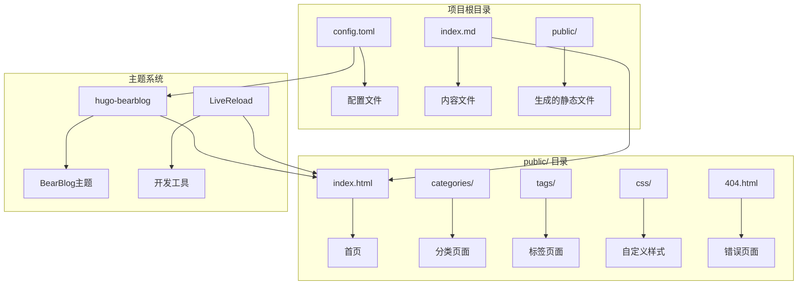
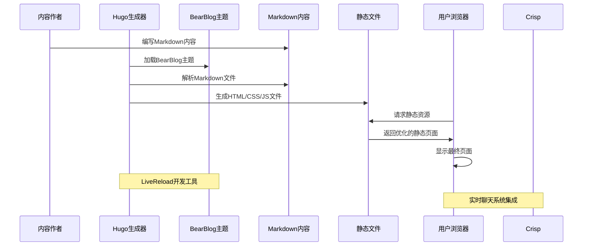
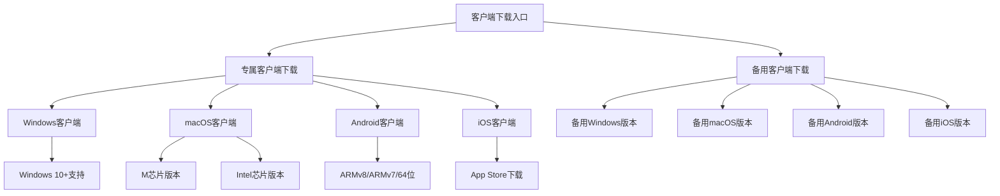
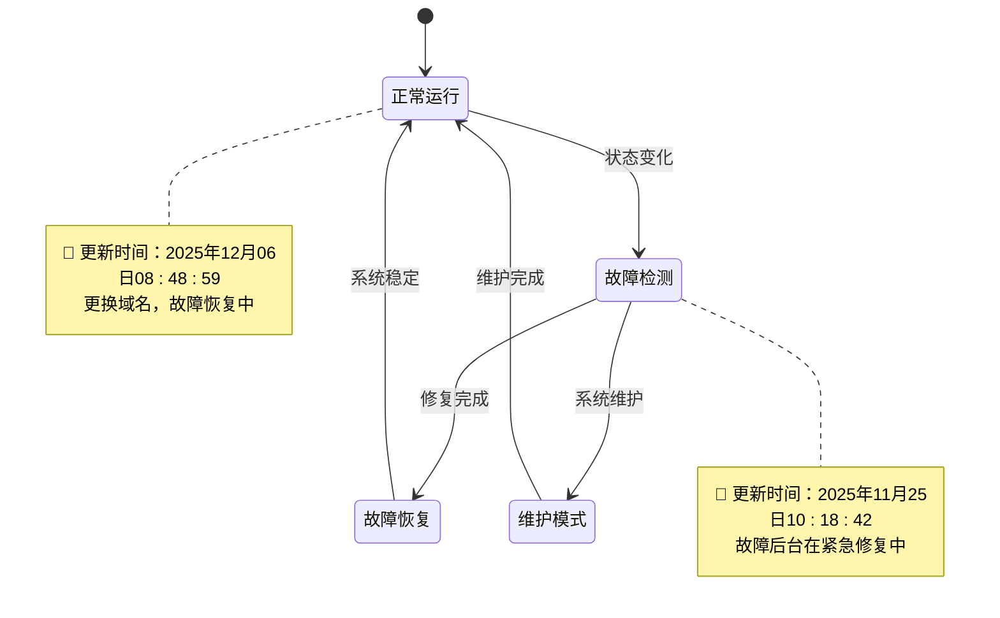
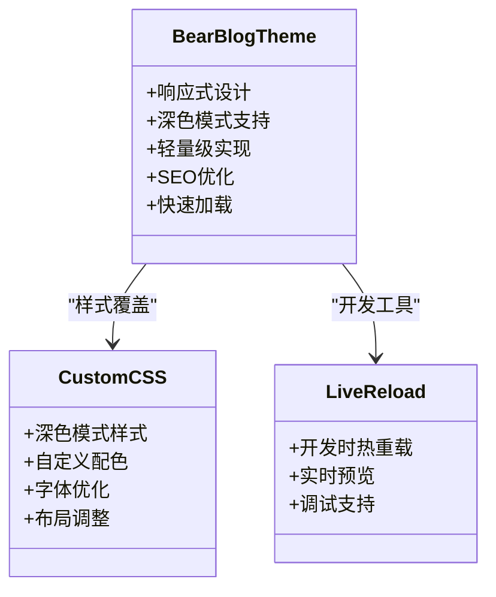
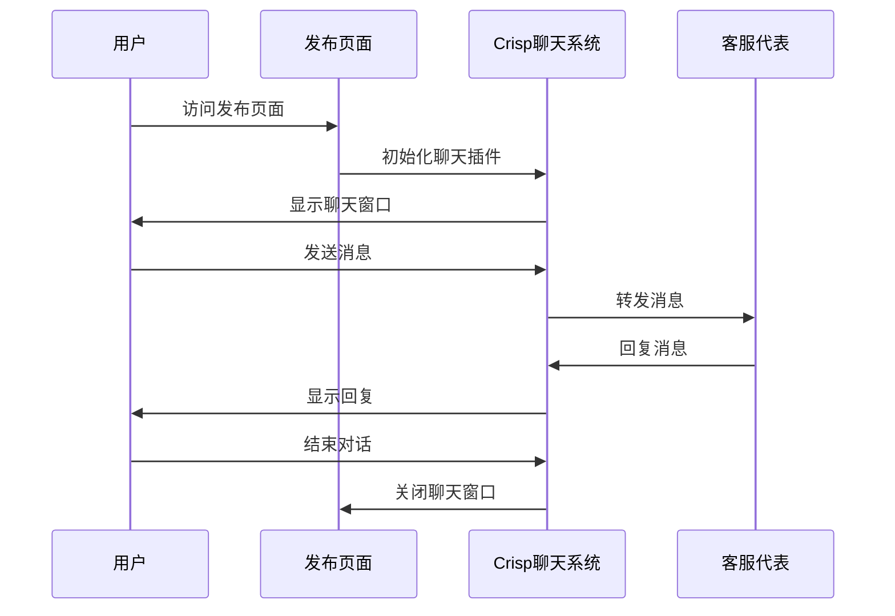
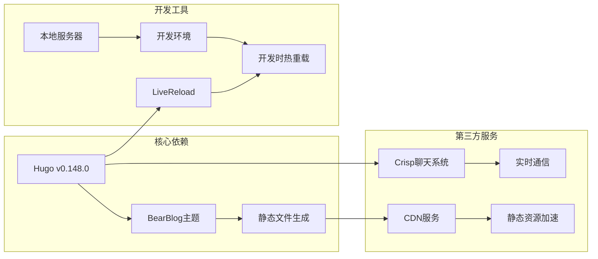
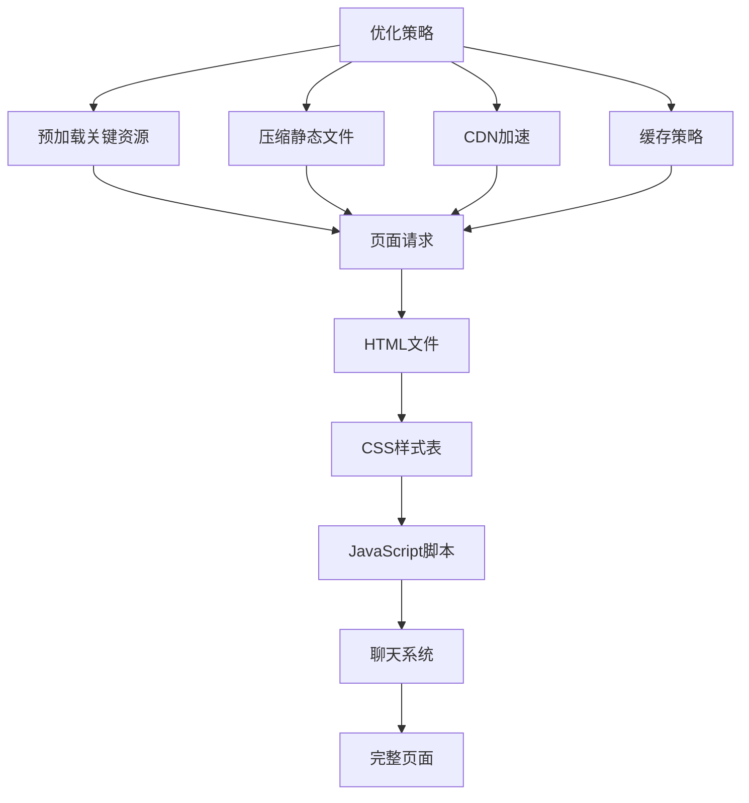
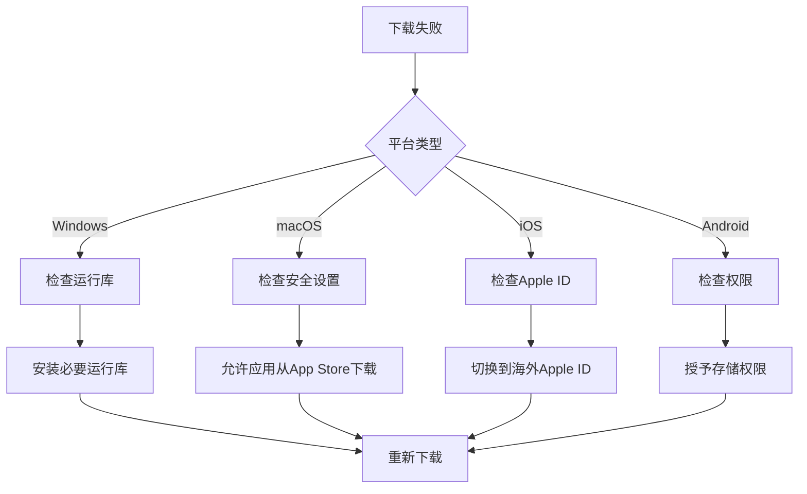
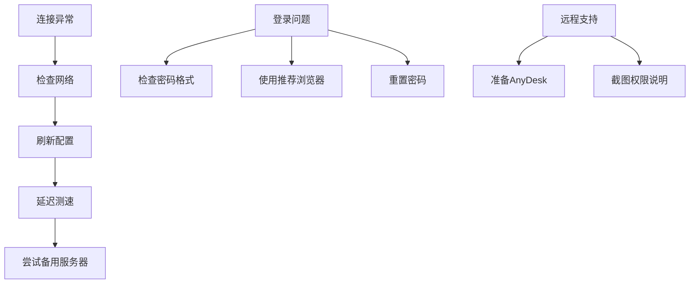

# 项目概述

<cite>
**本文档引用的文件**
- [config.toml](file://config.toml)
- [index.md](file://index.md)
- [public/index.html](file://public/index.html)
- [public/css/custom.css](file://public/css/custom.css)
- [public/_index-copy/index.html](file://public/_index-copy/index.html)
- [public/categories/index.html](file://public/categories/index.html)
- [public/tags/index.html](file://public/tags/index.html)
- [public/404.html](file://public/404.html)
</cite>

## 目录
1. [引言](#引言)
2. [项目结构](#项目结构)
3. [核心组件](#核心组件)
4. [架构概览](#架构概览)
5. [详细组件分析](#详细组件分析)
6. [依赖关系分析](#依赖关系分析)
7. [性能考虑](#性能考虑)
8. [故障排除指南](#故障排除指南)
9. [结论](#结论)

## 引言

这是一个基于Hugo静态网站生成器构建的多平台客户端发布页项目。该项目的核心目标是为多平台客户端提供统一的下载入口页面，通过简洁直观的界面展示各种平台的客户端下载链接，包括Windows、macOS、Android和iOS平台。

项目采用现代化的静态网站生成技术，结合Hugo v0.148.0的强大功能和BearBlog主题的优雅设计，为用户提供流畅的浏览体验。同时集成了Crisp聊天系统，提供实时客户服务支持。

## 项目结构

该项目采用了典型的Hugo项目结构，主要包含以下核心目录和文件：

**图表来源**
- [config.toml:1-8](file://config.toml#L1-L8)
- [public/index.html:1-251](file://public/index.html#L1-L251)

**章节来源**
- [config.toml:1-8](file://config.toml#L1-L8)
- [public/index.html:1-251](file://public/index.html#L1-L251)

## 核心组件

### Hugo静态生成器

项目使用Hugo v0.148.0作为核心静态网站生成器，该版本提供了强大的内容管理和模板渲染能力。Hugo通过其快速的构建速度和灵活的主题系统，为项目提供了稳定的技术基础。

### BearBlog主题

项目采用hugo-bearblog主题，这是一个轻量级、响应式的主题设计，具有以下特点：
- 简洁优雅的视觉设计
- 完全响应式布局
- 支持深色模式切换
- 轻量级的JavaScript实现
- 优化的SEO友好性

### Crisp聊天系统

集成的Crisp聊天系统为用户提供了实时客户服务支持，包括：
- 实时在线客服
- 客户问题快速响应
- 多语言支持
- 会话记录和管理

**章节来源**
- [config.toml:4](file://config.toml#L4)
- [public/index.html:235-245](file://public/index.html#L235-L245)

## 架构概览

项目采用经典的静态网站生成架构，整体流程如下：

**图表来源**
- [config.toml:1-8](file://config.toml#L1-L8)
- [public/index.html:5](file://public/index.html#L5)
- [public/index.html:235-245](file://public/index.html#L235-L245)

## 详细组件分析

### 内容管理系统

项目的核心内容由Markdown文件驱动，主要包含客户端下载信息、常见问题解答和备用下载方案。

#### 多平台客户端支持

项目精心设计了针对不同平台的客户端下载入口：

**图表来源**
- [index.md:9-52](file://index.md#L9-L52)

#### 实时状态显示系统

项目实现了动态的状态更新机制，通过JavaScript实现实时状态显示：

**图表来源**
- [public/index.html:211-224](file://public/index.html#L211-L224)

**章节来源**
- [index.md:1-52](file://index.md#L1-L52)
- [public/index.html:211-224](file://public/index.html#L211-L224)

### 主题和样式系统

项目采用BearBlog主题，结合自定义CSS实现个性化的视觉效果：

#### 主题特性

**图表来源**
- [public/css/custom.css:1-11](file://public/css/custom.css#L1-L11)
- [public/index.html:5](file://public/index.html#L5)

#### 动态样式系统

项目实现了完整的动态样式系统，包括：

- **深色模式支持**：根据系统偏好自动切换
- **自适应布局**：适配各种屏幕尺寸
- **高性能渲染**：最小化JavaScript依赖
- **无障碍访问**：符合WCAG标准

**章节来源**
- [public/css/custom.css:1-11](file://public/css/custom.css#L1-L11)
- [public/index.html:39-199](file://public/index.html#L39-L199)

### 聊天系统集成

Crisp聊天系统的集成提供了完整的客户服务解决方案：

**图表来源**
- [public/index.html:235-245](file://public/index.html#L235-L245)

**章节来源**
- [public/index.html:235-245](file://public/index.html#L235-L245)

## 依赖关系分析

项目的技术依赖关系清晰明确，主要依赖包括：

**图表来源**
- [config.toml:1-8](file://config.toml#L1-L8)
- [public/index.html:5](file://public/index.html#L5)
- [public/index.html:235-245](file://public/index.html#L235-L245)

**章节来源**
- [config.toml:1-8](file://config.toml#L1-L8)

## 性能考虑

### 静态资源优化

项目在性能方面采取了多项优化措施：

- **零运行时依赖**：完全静态生成，无服务器端处理
- **最小化CSS**：仅包含必要的样式规则
- **高效的图片处理**：支持响应式图片和懒加载
- **缓存策略**：利用浏览器缓存机制

### 加载性能

**图表来源**
- [public/index.html:39-199](file://public/index.html#L39-L199)

## 故障排除指南

### 常见问题解决

项目提供了完善的故障排除指南：

#### 下载问题

#### 连接问题

**图表来源**
- [index.md:34-41](file://index.md#L34-L41)

**章节来源**
- [index.md:34-52](file://index.md#L34-L52)

### 技术支持

项目提供了多层次的技术支持渠道：

- **邮件支持**：cdnc612@gmail.com
- **在线客服**：网站右下角Crisp聊天系统
- **Telegram群组**：社区交流平台
- **备用下载**：确保服务连续性

## 结论

这个基于Hugo的静态发布页项目成功地实现了多平台客户端统一下载入口的目标。通过采用现代的静态网站生成技术和优雅的主题设计，项目为用户提供了快速、可靠、美观的下载体验。

### 主要优势

1. **技术先进性**：使用Hugo v0.148.0和BearBlog主题，确保技术栈的现代化
2. **用户体验优秀**：简洁直观的界面设计，支持多种平台和设备
3. **可靠性强**：静态生成确保了高可用性和快速加载
4. **扩展性强**：模块化设计便于功能扩展和维护
5. **成本效益高**：无需服务器端处理，降低运营成本

### 未来发展方向

- **国际化支持**：增加多语言版本支持
- **功能增强**：添加下载统计和用户反馈功能
- **性能优化**：进一步提升页面加载速度
- **移动端优化**：针对移动设备进行专门优化

该项目为类似的应用发布需求提供了一个优秀的参考模板，展示了如何通过现代Web技术构建高效、可靠的静态发布页面。